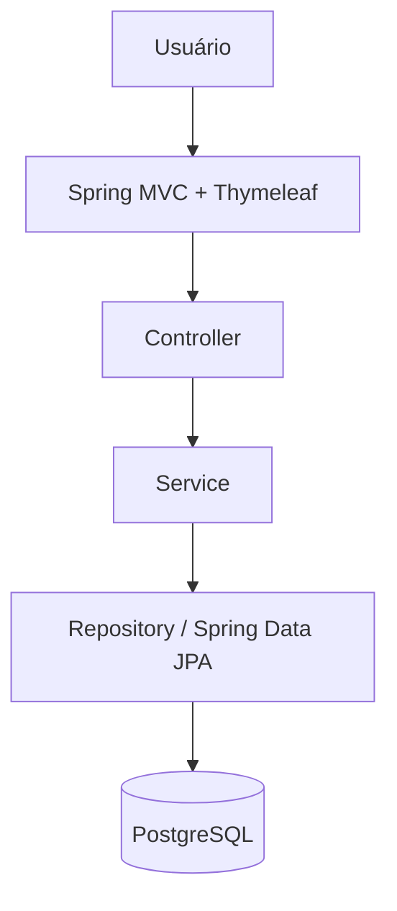
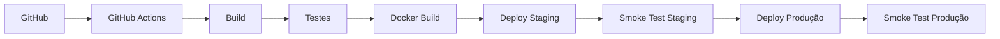

# Cidades ESG Inteligentes

Painel de Iniciativas Sustentáveis desenvolvido para a atividade **Desafio DevOps**.

## Sobre o projeto

O **Cidades ESG Inteligentes** é uma aplicação web para cadastro e acompanhamento de iniciativas ambientais, sociais e de governança realizadas por cidades.

O projeto foi desenvolvido em **Java com Spring Boot**, utiliza **PostgreSQL** como banco de dados e aplica práticas de DevOps com:

- Docker;
- Docker Compose;
- testes automatizados;
- GitHub Actions;
- pipeline CI/CD;
- ambientes de staging e produção;
- smoke tests automatizados.

Ao iniciar a aplicação com um banco vazio, cinco iniciativas de exemplo são cadastradas automaticamente para preencher o dashboard.

---

## Funcionalidades

- Dashboard com indicadores gerais;
- total de iniciativas cadastradas;
- total por categoria ESG;
- total de iniciativas concluídas;
- listagem de iniciativas;
- cadastro de novas iniciativas;
- visualização detalhada;
- edição;
- exclusão;
- validação dos campos do formulário;
- pontuação de impacto entre 1 e 10;
- categorias Ambiental, Social e Governança;
- controle de status;
- endpoint de saúde em `/actuator/health`.

---

## Arquitetura

A aplicação utiliza uma arquitetura em camadas.



Responsabilidades principais:

- **Controller:** recebe as requisições HTTP e prepara as páginas;
- **Service:** concentra as regras de negócio;
- **Repository:** realiza o acesso ao banco com Spring Data JPA;
- **Entity:** representa os dados persistidos;
- **Thymeleaf:** renderiza as páginas HTML;
- **Tailwind CSS:** responsável pela estilização da interface.

---

# Como executar o projeto

## Opção recomendada: Docker Compose

Para executar todo o projeto localmente, é necessário apenas:

- Docker Desktop;
- Docker Compose.

O PostgreSQL e a aplicação Spring Boot serão executados em containers.

### 1. Criar o arquivo de ambiente

No PowerShell:

```powershell
Copy-Item .env.example .env
```

### 2. Construir e iniciar os containers

```powershell
docker compose up --build -d
```

### 3. Verificar os containers

```powershell
docker compose ps
```

Devem estar em execução os serviços:

- `app`;
- `postgres`.

### 4. Acessar a aplicação

Aplicação:

```text
http://localhost:8080
```

Health Check:

```text
http://localhost:8080/actuator/health
```

O endpoint de saúde deve retornar o status:

```json
{
  "status": "UP"
}
```

### Visualizar os logs

```powershell
docker compose logs -f app
```

### Encerrar os containers

```powershell
docker compose down
```

Para também excluir os dados persistidos do PostgreSQL:

```powershell
docker compose down -v
```

> O comando com `-v` remove o volume do banco e deve ser usado somente quando for necessário apagar os dados locais.

---

## Execução sem Docker

Também é possível executar a aplicação diretamente com **Java 21** e um servidor **PostgreSQL** instalado localmente.

No PowerShell:

```powershell
$env:DB_HOST="localhost"
$env:DB_PORT="5432"
$env:DB_NAME="cidades_esg"
$env:DB_USER="esg_user"
$env:DB_PASSWORD="sua_senha"
$env:SPRING_PROFILES_ACTIVE="staging"

./mvnw.cmd spring-boot:run
```

A aplicação estará disponível em:

```text
http://localhost:8080
```

---

# Pipeline CI/CD

O pipeline está configurado no arquivo:

```text
.github/workflows/ci-cd.yml
```

Ele é executado automaticamente em:

- `push` para a branch `main`;
- `pull_request` destinado à branch `main`.

A sequência utilizada é:



## Etapas do pipeline

### 1. Build

Compila e empacota a aplicação utilizando:

- Java 21;
- Maven Wrapper.

### 2. Testes automatizados

Executa os testes com:

- JUnit 5;
- MockMvc;
- H2 em memória.

Os testes não dependem de um PostgreSQL externo.

### 3. Docker Build

Constrói a imagem definida no `Dockerfile` e valida se a aplicação pode ser corretamente containerizada.

### 4. Deploy de Staging

O GitHub Actions inicia um ambiente temporário utilizando:

```text
docker-compose.staging.yml
```

Nesse ambiente:

- aplicação e PostgreSQL são executados em containers;
- o profile Spring `staging` é utilizado;
- a aplicação é exposta na porta `8081`.

### 5. Smoke Test de Staging

O pipeline consulta:

```text
/actuator/health
```

e somente continua quando a aplicação retorna:

```text
UP
```

### 6. Deploy de Produção

Após o sucesso do ambiente de staging, é iniciado o ambiente de produção utilizando:

```text
docker-compose.prod.yml
```

Nesse ambiente:

- aplicação e banco possuem recursos separados;
- o profile `prod` é utilizado;
- a aplicação é exposta na porta `8082`.

### 7. Smoke Test de Produção

O endpoint de saúde é consultado novamente para validar o ambiente de produção.

---

## Observação sobre os deploys

Os ambientes de **staging** e **produção** utilizados neste projeto são criados temporariamente nos runners do GitHub Actions.

Portanto, eles demonstram o processo de deploy automatizado e validação da aplicação, mas **não representam servidores públicos permanentes**.

Os ambientes também podem ser visualizados no GitHub através de:

```text
Settings > Environments
```

utilizando os nomes:

```text
staging
production
```

---

# Ambiente de Staging

Para executar o ambiente de staging localmente:

```powershell
docker compose -f docker-compose.staging.yml up --build -d
```

Verificar a saúde:

```powershell
Invoke-RestMethod http://localhost:8081/actuator/health
```

Encerrar:

```powershell
docker compose -f docker-compose.staging.yml down
```

---

# Ambiente de Produção

Para executar o ambiente de produção localmente:

```powershell
docker compose -f docker-compose.prod.yml up --build -d
```

Verificar a saúde:

```powershell
Invoke-RestMethod http://localhost:8082/actuator/health
```

Encerrar:

```powershell
docker compose -f docker-compose.prod.yml down
```

---

# Containerização

O projeto utiliza um `Dockerfile` com **multi-stage build**.

### Etapa de build

Utiliza:

```text
maven:3.9.12-eclipse-temurin-21-alpine
```

Essa etapa:

- baixa as dependências;
- compila o projeto;
- gera o arquivo JAR.

### Etapa de execução

Utiliza:

```text
eclipse-temurin:21-jre-alpine
```

Essa imagem contém apenas os recursos necessários para executar a aplicação.

Também foram adotadas as seguintes práticas:

- execução com usuário sem privilégios `spring`;
- exposição apenas da porta `8080`;
- `HEALTHCHECK` usando Spring Boot Actuator;
- `.dockerignore` para reduzir o contexto enviado ao Docker.

---

# Docker Compose

O arquivo principal:

```text
docker-compose.yml
```

orquestra dois serviços:

```text
app
postgres
```

O ambiente possui:

- PostgreSQL containerizado;
- volume persistente;
- rede Docker própria;
- variáveis de ambiente;
- healthcheck do PostgreSQL;
- healthcheck da aplicação;
- `depends_on` condicionado à saúde do banco;
- reinício automático da aplicação no ambiente local.

O banco utiliza o volume:

```text
postgres-data
```

e a rede:

```text
esg-network
```

Os ambientes de staging e produção possuem bancos, redes e volumes separados.

---

# Testes automatizados

O profile de testes utiliza **H2 em memória**, evitando dependência de um banco PostgreSQL externo durante a execução dos testes.

Os testes incluem:

- carregamento do contexto Spring;
- validação da regra de pontuação entre 1 e 10;
- integração do dashboard utilizando MockMvc;
- validação do endpoint `/actuator/health`.

Executar somente os testes:

```powershell
./mvnw.cmd test
```

Executar build completo:

```powershell
./mvnw.cmd clean package
```

Em Linux/macOS:

```bash
./mvnw test
./mvnw clean package
```

---

# Variáveis de ambiente

| Variável                 | Exemplo             | Finalidade                 |
| ------------------------ | ------------------- | -------------------------- |
| `DB_HOST`                | `postgres`          | Host do PostgreSQL         |
| `DB_PORT`                | `5432`              | Porta do PostgreSQL        |
| `DB_NAME`                | `cidades_esg`       | Nome do banco              |
| `DB_USER`                | `esg_user`          | Usuário do banco           |
| `DB_PASSWORD`            | `troque_esta_senha` | Senha do banco             |
| `SPRING_PROFILES_ACTIVE` | `staging`           | Profile Spring ativo       |
| `SERVER_PORT`            | `8080`              | Porta interna da aplicação |

O arquivo:

```text
.env.example
```

serve como modelo.

O arquivo real:

```text
.env
```

está ignorado pelo Git e não deve ser versionado com credenciais reais.

---

# Tecnologias utilizadas

- Java 21;
- Spring Boot 3.5.16;
- Spring MVC;
- Spring Data JPA;
- Bean Validation;
- Thymeleaf;
- Tailwind CSS;
- PostgreSQL 17;
- H2;
- Maven;
- Maven Wrapper;
- JUnit 5;
- MockMvc;
- Docker;
- Docker Compose;
- GitHub Actions;
- Spring Boot Actuator.

---

# Estrutura do projeto

```text
atividade-devops/
├── .github/
│   └── workflows/
│       └── ci-cd.yml
├── .mvn/
│   └── wrapper/
│       └── maven-wrapper.properties
│ 
├── src/
│   ├── main/
│   │   ├── java/br/edu/cidadesesg/
│   │   │   ├── config/
│   │   │   ├── controller/
│   │   │   ├── model/
│   │   │   ├── repository/
│   │   │   └── service/
│   │   └── resources/
│   │       └── templates/
│   └── test/
├── Dockerfile
├── docker-compose.yml
├── docker-compose.staging.yml
├── docker-compose.prod.yml
├── mvnw
├── mvnw.cmd
└── pom.xml
```

---


---

# Comandos úteis

```powershell
# Testes
./mvnw.cmd test

# Build
./mvnw.cmd clean package

# Iniciar ambiente local
docker compose up --build -d

# Ver containers
docker compose ps

# Ver logs da aplicação
docker compose logs -f app

# Health Check
Invoke-RestMethod http://localhost:8080/actuator/health

# Encerrar ambiente local
docker compose down

# Validar os arquivos Docker Compose
docker compose config
docker compose -f docker-compose.staging.yml config
docker compose -f docker-compose.prod.yml config
```

---

# Checklist da atividade

- [x] Aplicação Spring Boot funcional
- [x] Estrutura em camadas
- [x] CRUD de iniciativas
- [x] PostgreSQL
- [x] Dockerfile
- [x] Multi-stage build
- [x] Docker Compose
- [x] PostgreSQL containerizado
- [x] Volume persistente
- [x] Rede Docker
- [x] Variáveis de ambiente
- [x] `.env.example`
- [x] Healthcheck da aplicação
- [x] Healthcheck do PostgreSQL
- [x] Testes automatizados
- [x] Build automatizado
- [x] Docker Build automatizado
- [x] Pipeline CI/CD
- [x] Deploy de staging
- [x] Smoke test de staging
- [x] Deploy de produção
- [x] Smoke test de produção
- [x] GitHub Actions
- [x] Evidências reais da execução
- [x] Documentação técnica

---

## Conclusão

O projeto demonstra um fluxo completo de desenvolvimento e entrega de uma aplicação web, integrando desenvolvimento Java, banco de dados, testes automatizados, containerização e CI/CD.

A aplicação pode ser executada integralmente com Docker Compose, enquanto o GitHub Actions automatiza as etapas de build, testes, construção da imagem Docker, deploy de staging, validação de saúde e deploy de produção.
