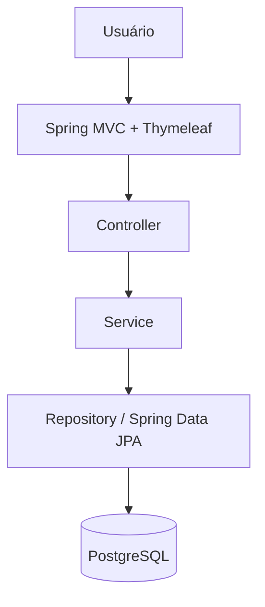
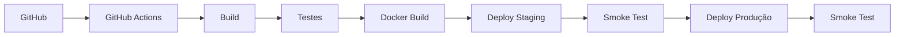

# Projeto - Cidades ESG Inteligentes

Painel de Iniciativas Sustentáveis desenvolvido para tarefa: **ATIVIDADE – DESAFIO DEVOPS**

## Sobre o projeto

O sistema permite registrar e acompanhar iniciativas ambientais, sociais e de governança realizadas por cidades. A solução foi mantida intencionalmente pequena: uma aplicação web Spring Boot com páginas renderizadas no servidor, PostgreSQL e automação completa de build, testes e deploy demonstrativo.

Ao iniciar com um banco vazio, cinco iniciativas de exemplo são inseridas automaticamente para preencher o dashboard.

## Funcionalidades

- Dashboard com total geral, total por categoria ESG e total de concluídas;
- listagem responsiva de iniciativas;
- cadastro, consulta detalhada, edição e exclusão;
- validação de campos e pontuação de impacto entre 1 e 10;
- badges de categoria e status;
- mensagens de sucesso e erros de formulário;
- endpoint de saúde em `/actuator/health`;
- carga automática de dados iniciais quando o banco está vazio.

## Arquitetura

A aplicação segue uma separação simples entre Controller, Service, Repository e Entity.



O Controller recebe as requisições e prepara as páginas; o Service concentra as regras; o Repository acessa o banco; o Thymeleaf gera o HTML e o Tailwind CSS via CDN cuida do visual.

## Como executar localmente

Pré-requisitos: Java 21 e PostgreSQL. Crie o banco e defina as variáveis de ambiente. No PowerShell:

```powershell
$env:DB_HOST="localhost"
$env:DB_PORT="5432"
$env:DB_NAME="cidades_esg"
$env:DB_USER="esg_user"
$env:DB_PASSWORD="sua_senha"
$env:SPRING_PROFILES_ACTIVE="staging"
./mvnw.cmd spring-boot:run
```

Em Linux/macOS, use `export NOME=valor` e execute `./mvnw spring-boot:run`. Acesse [http://localhost:8080](http://localhost:8080).

## Como executar localmente com Docker

Pré-requisito: Docker Desktop com Docker Compose.

```powershell
Copy-Item .env.example .env
docker compose up --build -d
docker compose ps
```

Edite a senha em `.env` antes de uso fora de uma demonstração local. A aplicação estará em [http://localhost:8080](http://localhost:8080) e a saúde em [http://localhost:8080/actuator/health](http://localhost:8080/actuator/health).

Para acompanhar e encerrar:

```powershell
docker compose logs -f app
docker compose down
```

Use `docker compose down -v` somente se também quiser apagar os dados persistidos no volume local.

## Pipeline CI/CD

O workflow `[.github/workflows/ci-cd.yml](.github/workflows/ci-cd.yml)` roda em `push` para `main` e em `pull_request` destinado a `main`. Os jobs usam `needs` para garantir esta sequência:



1. **Build:** compila e empacota com Java 21 e Maven Wrapper;
2. **Testes:** executa JUnit 5 usando H2 em memória;
3. **Docker Build:** confirma que a imagem multi-stage é construída;
4. **Deploy Staging:** sobe aplicação e PostgreSQL com Compose na porta 8081;
5. **Smoke Test:** consulta `/actuator/health` até obter `UP` ou falhar;
6. **Deploy Produção:** só inicia depois da aprovação de staging e usa a porta 8082;
7. **Smoke Test:** repete a validação de saúde em produção.

Os GitHub Environments `staging` e `production` são referenciados pelo workflow e podem ser criados em **Settings > Environments** para exibir o histórico ou adicionar aprovação manual. Nenhum secret é obrigatório para a demonstração básica.

## Ambiente de Staging

O arquivo `docker-compose.staging.yml` cria rede, volume e banco próprios e ativa o profile `staging`. Para testar localmente:

```powershell
docker compose -f docker-compose.staging.yml up --build -d
Invoke-RestMethod http://localhost:8081/actuator/health
docker compose -f docker-compose.staging.yml down
```

No pipeline, esse ambiente existe temporariamente no runner do GitHub Actions. Ele demonstra um deploy automatizado containerizado; não representa um servidor ou URL pública.

## Ambiente de Produção

O arquivo `docker-compose.prod.yml` utiliza recursos separados, profile `prod` e porta 8082:

```powershell
docker compose -f docker-compose.prod.yml up --build -d
Invoke-RestMethod http://localhost:8082/actuator/health
docker compose -f docker-compose.prod.yml down
```

Assim como staging, produção é um ambiente containerizado temporário para fins acadêmicos, executado no runner do pipeline e sem URL pública.

## Containerização

O `Dockerfile` usa multi-stage build:

- `maven:3.9.12-eclipse-temurin-21-alpine` baixa dependências e gera o JAR;
- `eclipse-temurin:21-jre-alpine` executa apenas o artefato final;
- o processo roda com o usuário sem privilégios `spring`;
- somente a porta 8080 é exposta;
- o `HEALTHCHECK` consulta o Actuator;
- `.dockerignore` reduz o contexto enviado ao Docker.

## Docker Compose

O Compose principal orquestra `app` e `postgres`. Ele fornece:

- volume nomeado `postgres-data` para persistência;
- rede própria `esg-network`;
- variáveis de ambiente com valores substituíveis por `.env`;
- `depends_on` condicionado à saúde do PostgreSQL;
- healthchecks do banco e da aplicação;
- reinício automático no ambiente local.

As composições de staging e produção possuem nomes, redes, bancos e volumes separados, permitindo execução simultânea sem conflito.

## Testes automatizados

Os testes não dependem de PostgreSQL externo. O profile `test` configura H2 em memória e inclui:

- carregamento do contexto Spring;
- regra do Service que rejeita pontuação fora de 1 a 10;
- integração do dashboard com MockMvc;
- verificação do endpoint `/actuator/health`.

No PowerShell:

```powershell
./mvnw.cmd test
./mvnw.cmd clean package
```

Em Linux/macOS:

```bash
./mvnw test
./mvnw clean package
```

## Variáveis de ambiente

| Variável                 | Exemplo             | Finalidade             |
| ------------------------ | ------------------- | ---------------------- |
| `DB_HOST`                | `postgres`          | Host do PostgreSQL     |
| `DB_PORT`                | `5432`              | Porta do banco         |
| `DB_NAME`                | `cidades_esg`       | Nome do banco          |
| `DB_USER`                | `esg_user`          | Usuário do banco       |
| `DB_PASSWORD`            | `troque_esta_senha` | Senha do banco         |
| `SPRING_PROFILES_ACTIVE` | `staging`           | Profile Spring ativo   |
| `SERVER_PORT`            | `8080`              | Porta interna opcional |

O arquivo `.env.example` é apenas um modelo. Copie-o para `.env`, que está ignorado pelo Git, e nunca versione senhas reais.

## Tecnologias utilizadas

- Java 21;
- Spring Boot 3.5.16;
- Spring MVC, Spring Data JPA e Bean Validation;
- Thymeleaf e Tailwind CSS via CDN;
- PostgreSQL 17 e H2 para testes;
- Maven e Maven Wrapper;
- JUnit 5 e MockMvc;
- Docker, Docker Compose e GitHub Actions;
- Spring Boot Actuator.

## Estrutura do projeto

```text
atividade-devops/
├── .github/workflows/ci-cd.yml
├── .mvn/wrapper/maven-wrapper.properties
├── docs/
│   ├── evidencias/README.md
│   ├── documentacao-tecnica.md
│   └── roteiro-apresentacao.md
├── src/
│   ├── main/java/br/edu/cidadesesg/
│   │   ├── config/
│   │   ├── controller/
│   │   ├── model/
│   │   ├── repository/
│   │   └── service/
│   ├── main/resources/templates/
│   └── test/
├── Dockerfile
├── docker-compose.yml
├── docker-compose.staging.yml
├── docker-compose.prod.yml
├── mvnw
├── mvnw.cmd
└── pom.xml
```

## Comandos úteis

```powershell
# Testes e build
./mvnw.cmd test
./mvnw.cmd clean package

# Ambiente local
docker compose up --build -d
docker compose ps
docker compose logs -f app
Invoke-RestMethod http://localhost:8080/actuator/health
docker compose down

# Validar os três arquivos Compose sem subir containers
docker compose config
docker compose -f docker-compose.staging.yml config
docker compose -f docker-compose.prod.yml config
```

## Checklist da atividade

- [x] Projeto com estrutura organizada
- [x] Dockerfile funcional
- [x] docker-compose.yml
- [x] Banco PostgreSQL containerizado
- [x] Volume persistente
- [x] Rede Docker
- [x] Variáveis de ambiente
- [x] .env.example
- [x] Pipeline CI/CD
- [x] Build automatizado
- [x] Testes automatizados
- [x] Deploy staging
- [x] Deploy produção
- [x] README técnico
- [x] Prints
- [x] Documentação técnica
